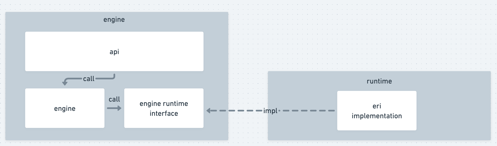
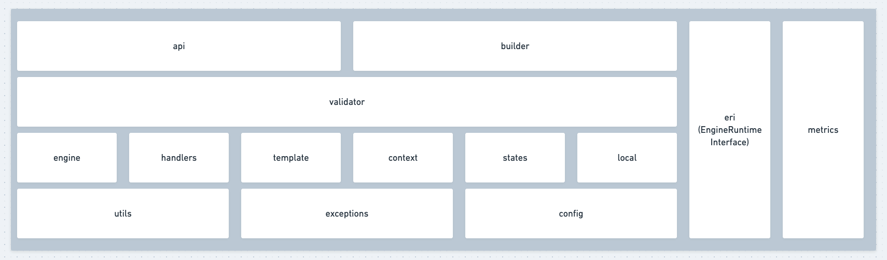

# bamboo-engine: A event-driven workflow engine for Python

[](https://github.com/TencentBlueKing/bamboo-engine/blob/master/LICENSE.txt)
[](https://github.com/TencentBlueKing/bamboo-engine/pulls)
[](https://github.com/TencentBlueKing/bamboo-engine/)
[](https://github.com/TencentBlueKing/bamboo-engine/)
[](https://codecov.io/gh/TencentBlueKing/bamboo-engine)
[](https://api.bkdevops.qq.com/process/api/external/pipelines/projects/blueapps/p-d620b6131c994e76ba292ae359c162f1/badge?X-DEVOPS-PROJECT-ID=blueapps)

[(English Documents Available)](README_en.md)

bamboo-engine 是一个通用的流程引擎，他可以解析，执行，调度由用户创建的流程任务，并提供了如暂停，撤销，跳过，强制失败，重试和重入等等灵活的控制能力和并行、子流程等进阶特性，并可通过水平扩展来进一步提升任务的并发处理能力。

<!-- TOC -->
- [整体设计](#整体设计)
- [Quick start](#quick-start)
  - [1. 安装依赖](#1-安装依赖)
  - [2. 项目初始化](#2-项目初始化)
  - [3. 执行流程](#3-执行流程)
- [benchmark](#benchmark)

<!-- /TOC -->
- 使用文档
  - [核心概念](./docs/user_guide/basic_concept.md)
  - [流程编排](./docs/user_guide/flow_orchestration.md)
  - [流程构造器](./docs/user_guide/flow_builder.md)
  - [流程构造生成树字段摘要](./docs/user_guide/builded_pipeline_tree_schema.md)
  - [SPLICE 变量](./docs/user_guide/splice_var.md)
  - [Engine API](./docs/user_guide/engine_api.md)
  - [Metrics](./docs/user_guide/monitor.md)
  - 升级指引
    - [如何升级到 2.x 版本](./docs/upgrade/bamboo_engine_2.md)
- 运行时文档
  - bamboo-pipeline
    - [自定义组件](./docs/user_guide/custom_component.md)
    - [运行自定义组件](./docs/user_guide/run_your_component.md)
    - [组件单元测试](./docs/user_guide/component_unit_test.md)
    - [Worker 配置](./docs/user_guide/workers.md)
    - [引擎管理端配置](./docs/user_guide/engine_admin_config.md)
    - [运行时钩子](./docs/user_guide/signals.md)
    - [设置](./docs/user_guide/settings.md)


## 整体设计



bamboo-engine 是流程引擎核心模块、调度逻辑的定义和实现，并没有内置特定的引擎运行时，需要搭配实现了 `bamboo_engine.eri.interfaces.EngineRuntimeInterface` 接口的引擎运行时使用，目前提供了以下运行时可供使用：

- 基于 Django，Celery 的运行时：[bamboo-pipeline](./runtime/bamboo-pipeline)


engine 模块结构：



## Quick start

### 1. 安装依赖

```
$ pip install bamboo-pipeline
```
### 2. 项目初始化

由于 `bamboo-pipeline` 运行时基于 Django 实现，所以需要新建一个 Django 项目：

```
$ django-admin startproject bamboo_engine_playground
$ cd bamboo_engine_playground
```

在 `bamboo_engine_playground.settings.py` 下添加如下配置：

```python
from pipeline.eri.celery.queues import *
from celery import Celery

app = Celery("proj")

app.config_from_object("django.conf:settings")

INSTALLED_APPS = [
    ...
    "pipeline.component_framework",
    "pipeline.eri",
    ...
]
```

在 `bamboo_engine_playground` 目录下初始化数据库：

```
$ python manage.py migrate
```

### 3. 执行流程

首先在 `bamboo_engine_playground` 目录下启动 celery worker：

```
$ DJANGO_SETTINGS_MODULE=bamboo_engine_playground.settings celery worker -A bamboo_engine_playground.settings -Q er_execute,er_schedule -l info
```

创建并执行一个简单的流程：


```python
import time

from bamboo_engine import api
from bamboo_engine.builder import *
from pipeline.eri.runtime import BambooDjangoRuntime

# 使用 builder 构造出流程描述结构
start = EmptyStartEvent()
# 这里先使用 bamboo-pipeline 自带的示例组件，我们会在后续的章节中学习如何自定义组件
act = ServiceActivity(component_code="example_component")
end = EmptyEndEvent()

start.extend(act).extend(end)

pipeline = builder.build_tree(start)

# 执行流程对象
runtime = BambooDjangoRuntime()

# 如果需要忽略流程中的环检查，可以指定为True cycle_tolerate
# api.run_pipeline(runtime=runtime, pipeline=pipeline, cycle_tolerate=True)
api.run_pipeline(runtime=runtime, pipeline=pipeline)

# 等待 1s 后获取流程执行结果
time.sleep(1)

result = api.get_pipeline_states(runtime=runtime, root_id=pipeline["id"])

print(result.data)
```

随后我们就能够看到流程的状态信息，如下所示，流程中的所有节点已经执行成功：

```python
{'pc31c89e6b85a4e2c8c5db477978c1a57': {'id': 'pc31c89e6b85a4e2c8c5db477978c1a57',
  'state': 'FINISHED',
  'root_id:': 'pc31c89e6b85a4e2c8c5db477978c1a57',
  'parent_id': 'pc31c89e6b85a4e2c8c5db477978c1a57',
  'version': 'vaf47e56f2f31401e979c3c47b2a0c285',
  'loop': 1,
  'retry': 0,
  'skip': False,
  'created_time': datetime.datetime(2021, 3, 10, 3, 45, 54, 688664, tzinfo=<UTC>),
  'started_time': datetime.datetime(2021, 3, 10, 3, 45, 54, 688423, tzinfo=<UTC>),
  'archived_time': datetime.datetime(2021, 3, 10, 3, 45, 54, 775165, tzinfo=<UTC>),
  'children': {'e42035b3f98374062921a191115fc602e': {'id': 'e42035b3f98374062921a191115fc602e',
    'state': 'FINISHED',
    'root_id:': 'pc31c89e6b85a4e2c8c5db477978c1a57',
    'parent_id': 'pc31c89e6b85a4e2c8c5db477978c1a57',
    'version': 've2d0fa10d7d842a1bcac25984620232a',
    'loop': 1,
    'retry': 0,
    'skip': False,
    'created_time': datetime.datetime(2021, 3, 10, 3, 45, 54, 744490, tzinfo=<UTC>),
    'started_time': datetime.datetime(2021, 3, 10, 3, 45, 54, 744308, tzinfo=<UTC>),
    'archived_time': datetime.datetime(2021, 3, 10, 3, 45, 54, 746690, tzinfo=<UTC>)},
   'e327f83de42df4ebfab375c271bf63d29': {'id': 'e327f83de42df4ebfab375c271bf63d29',
    'state': 'FINISHED',
    'root_id:': 'pc31c89e6b85a4e2c8c5db477978c1a57',
    'parent_id': 'pc31c89e6b85a4e2c8c5db477978c1a57',
    'version': 'v893cdc14150d4df5b20f2db32ba142b3',
    'loop': 1,
    'retry': 0,
    'skip': False,
    'created_time': datetime.datetime(2021, 3, 10, 3, 45, 54, 753321, tzinfo=<UTC>),
    'started_time': datetime.datetime(2021, 3, 10, 3, 45, 54, 753122, tzinfo=<UTC>),
    'archived_time': datetime.datetime(2021, 3, 10, 3, 45, 54, 758697, tzinfo=<UTC>)},
   'e6c7d7a3721ca4b19a5a7f3b34d8387bf': {'id': 'e6c7d7a3721ca4b19a5a7f3b34d8387bf',
    'state': 'FINISHED',
    'root_id:': 'pc31c89e6b85a4e2c8c5db477978c1a57',
    'parent_id': 'pc31c89e6b85a4e2c8c5db477978c1a57',
    'version': 'v0c661ee6994d4eb4bdbfe5260f9a9f22',
    'loop': 1,
    'retry': 0,
    'skip': False,
    'created_time': datetime.datetime(2021, 3, 10, 3, 45, 54, 767563, tzinfo=<UTC>),
    'started_time': datetime.datetime(2021, 3, 10, 3, 45, 54, 767384, tzinfo=<UTC>),
    'archived_time': datetime.datetime(2021, 3, 10, 3, 45, 54, 773341, tzinfo=<UTC>)}}}}
```

恭喜你，你已经成功的创建了一个流程并把它运行起来了！

## benchmark


测试环境：

- MacBook Pro（16 英寸，2019）
- 处理器：2.6 GHz 六核Intel Core i7
- 内存：32 GB 2667 MHz DDR4
- OS：macOS Big Sur 11.2.1
- Broker：RabbitMQ 3.8.2
- MySQL：5.7.22
- worker 启动命令（单个 worker 进程 -c 参数不变，通过增加进程来提高并发处理能力）
  - python manage.py celery worker -c 100 -P gevent -l info -Q er_execute -n execute_%(process_num)02d
  - python manage.py celery worker -c 100 -P gevent -l info -Q er_schedule -n schedule_%(process_num)02d

| 测试场景                          | worker concurrency | 流程执行耗时(s) |
| --------------------------------- | ------------------ | --------------- |
| 100个流程(单流程17个节点)并发执行 | 100                | 25.98           |
| 100个流程(单流程17个节点)并发执行 | 200                | 14.75           |
| 100个流程(单流程17个节点)并发执行 | 500                | 8.29            |
| 100个流程(单流程17个节点)并发执行 | 1000               | 6.78            |
| 1000节点大流程                    | 100                | 19.33           |
| 1000节点大流程                    | 200                | 12.5            |
| 1000节点大流程                    | 500                | 11              |
| 1000节点大流程                    | 1000               | 7.5             |


## Roadmap

- [版本日志](release.md)

## Support

- [蓝鲸论坛](https://bk.tencent.com/s-mart/community)
- [蓝鲸 DevOps 在线视频教程](https://bk.tencent.com/s-mart/video/)
- 联系我们，技术交流QQ群：


## BlueKing Community

- [BK-CI](https://github.com/Tencent/bk-ci)：蓝鲸持续集成平台是一个开源的持续集成和持续交付系统，可以轻松将你的研发流程呈现到你面前。
- [BK-BCS](https://github.com/Tencent/bk-bcs)：蓝鲸容器管理平台是以容器技术为基础，为微服务业务提供编排管理的基础服务平台。
- [BK-PaaS](https://github.com/Tencent/bk-PaaS)：蓝鲸PaaS平台是一个开放式的开发平台，让开发者可以方便快捷地创建、开发、部署和管理SaaS应用。
- [BK-SOPS](https://github.com/Tencent/bk-sops)：标准运维（SOPS）是通过可视化的图形界面进行任务流程编排和执行的系统，是蓝鲸体系中一款轻量级的调度编排类SaaS产品。
- [BK-CMDB](https://github.com/Tencent/bk-cmdb)：蓝鲸配置平台是一个面向资产及应用的企业级配置管理平台。

## Contributing

如果你有好的意见或建议，欢迎给我们提 Issues 或 Pull Requests，为蓝鲸开源社区贡献力量。

1. 本项目使用 [Poetry](https://python-poetry.org/) 进行开发、构建及发布，本地开发环境搭建请参考 Poetry 官方文档
2. PR 需要通过 CI 中的所有代码风格检查，单元测试及集成测试才可被接受合并
3. 新增加的模块请确保完备的单元测试覆盖

## License

基于 MIT 协议， 详细请参考[LICENSE](LICENSE.txt)
