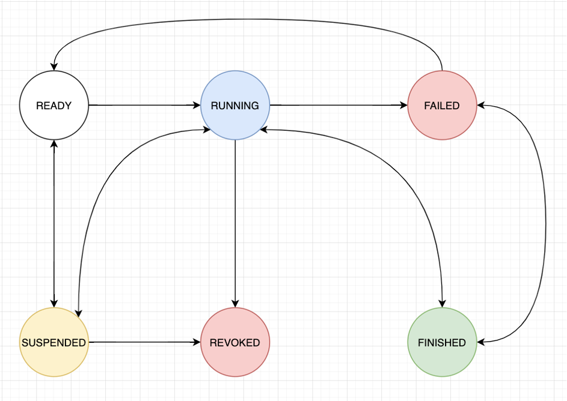

<!-- TOC -->

- [流程](#流程)
- [节点](#节点)
  - [event](#event)
  - [activity](#activity)
  - [gateway](#gateway)
  - [subprocess](#subprocess)
- [状态](#状态)
- [顺序流](#顺序流)
- [ID](#id)
- [组件](#组件)
- [数据交换](#数据交换)
  - [执行数据](#执行数据)
  - [上下文](#上下文)
  - [变量（Var）](#变量var)

<!-- /TOC -->

## 流程

以特定节点开始，特定节点结束的有向图

## 节点

流程图中除了边以外的元素，流程本身也是一个节点

### event

一个流程至少会拥有两个事件，一个开始事件（`StartEvent`）和结束事件（`EndEvent`），开始事件的完成标志一个流程的执行开始，而结束事件的完成则标志一个 `Pipeline` 的执行完成。

### activity

一个 `Activity` 对象代表了某项活动，比如发起网络请求，操作数据库，执行命令等等，`Activity` 的行为通常由用户来定义。

### gateway

gateway 在流程中起到了引流的作用，网关会决定一个任务流程的执行走向和行为，如分支网关（`ExclusiveGateway`）决定了接下来需要引擎需要执行的路径，并行网关（`ParallelGateway`）会增加当前流程的执行进程数，条件并行网关（`ConditionalParallelGateway`）会根据当前上下文的信息来判断当前流程的增加的执行进程数，而汇聚网关（`ConvergeGateway`）则会减少当前流程的执行进程数。

### subprocess

子流程（`SubProcess`）是流程中一种特殊的节点，当一个流程作为另一个流程的某个节点出现在其结构中，我们就把这个前者称为后者的子流程，通过使用子流程，开发者能够对流程重用，减少重复编码。

## 状态

每个节点都拥有一个对应的状态对象，节点状态流转示意如下

## 顺序流

流程图中的有向边

## ID

流程、节点和顺序流在系统中的唯一标志符

## 组件

特定业务逻辑的封装，用于定义流程活动节点的逻辑。

## 数据交换

### 执行数据

流程对象中每个节点都拥有一个执行数据，这个执行数据用于存储节点的输入和输出数据，每个节点之间的执行数据是相互隔离的，也就是说，节点1不能直接访问节点2的输出。

### 上下文

在整个流程执行的过程中，节点之间并不是完全孤立的，某些时候节点需要进行通信，例如，节点2需要获取节点1的执行结果，并根据该结果来决定接下来的行为，由于在一个流程中每个节点之间的数据是相互隔离的，无法在节点内实现对其他节点数据的直接访问，所以，每个流程会拥有一个用于进行节点通信和数据传递的上下文。

节点1能够将自己在执行过程中生成的某些数据写到上下文中，当其他节点需要使用的时候，只需要从上下文中获取这些数据即可。

执行数据与上下文之间的数据交换如下图所示：

> 为什么不能在节点中直接访问其他节点与上下文的数据？在节点中直接访问其他节点与上下文中的数据固然方便，但是这样可能会导致在实现组件时过度依赖当前上下文的结构与流程结构，从而破坏了组件的独立性与可复用性。pipeline 中的每种活动节点都是独立的个体，即：无论在什么结构下的流程中、在流程中的什么位置都能够正确的执行。

### 变量（Var）

在定义流程时，通过变量（Var）能够声明上下文和节点执行数据中的数据，以及变量之间的引用关系，目前框架中提供了以下三种类型的变量：

- PLAIN：常量类型的变量，其值在声明后就不会发生变化，这种变量的声明十分简单：`{'type': 'plain', 'value': 'var value'}`
- SPLICE：拼接类型的变量，这种变量的值能够引用其他变量并且根据需求进行一定程度的拼接和 python 操作，SPLICE 类型变量的详细使用说明可以参考 [SPLICE 变量使用](./user_guide_splice_var.md) 章节
- LAZY：延迟获取值类型的变量，这种变量在进行解析前可以执行一段自定义的代码来获取特定的值，更加详细的说明可以参考 [LAZY 变量](./user_guide_lazy_variable.md) 章节
