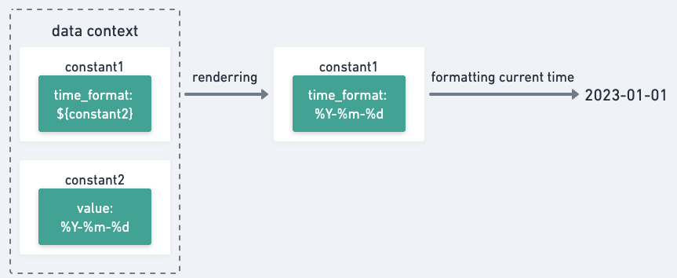

<!-- TOC -->

- [LAZY 变量](#lazy-变量)
  - [变量引用](#变量引用)
  - [自定义处理](#自定义处理)

<!-- /TOC -->

## LAZY 变量

LAZY 类型的变量除了能够帮助我们声明变量与变量间的引用关系，还能让我们在 SPICE 变量的基础上，自定义对引用解析结果的进一步操作和处理逻辑。


### 变量引用

LAZY 类型的变量引用能力，继承自 SPICE 变量的实现，具体说明可参考 [SPICE 变量使用说明](splice_var.md)。

### 自定义处理

LAZY 类型变量对应 `pipeline.core.data.var.LazyVariable` 类，是一个继承了 `pipeline.core.data.var.SpliceVariable` 类的抽象类，
抽象方法是 `get_value`，在 `get_value` 方法中，我们可以对引用解析结果进行进一步处理。

下面以【支持格式自定义的系统当前时间】为例，介绍如何通过 LAZY 变量实现支持变量引用和自定义处理的系统当前时间变量。

```python
import datetime
from pipeline.core.data.var import LazyVariable

class FormatSupportCurrentTime(LazyVariable):
    code = "format_support_current_time"
    name = "支持格式自定义的系统当前时间"

    def get_value(self):
        time_format = self.value.get("time_format", "%Y-%m-%d %H:%M:%S").strip()
        now = datetime.datetime.now()
        current_time = now.strftime(time_format)
        return current_time
```

在 `get_value` 方法中，我们通过 `self.value` 获取到引用解析之后的时间格式数据，然后获取当前时间，并将其转换为对应的时间格式后输出，过程如下图所示：

